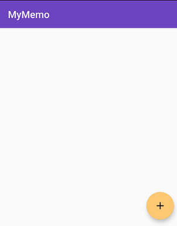
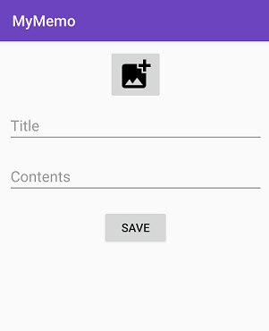
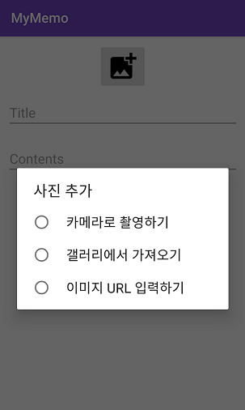

# MyMemo
사진 여러장을 포함할 수 있는 안드로이드 메모장 애플리케이션입니다.

### Environment
* Language: Java
* IDE: Android Studio
* minSdkVersion: 21
* targetSdkVersion: 28

## How to Use

> 앱의 메인 화면입니다. 왼쪽 하단의 +버튼을 통하여 새로운 메모를 작성할 수 있습니다.

> 메모 작성 화면입니다. 사진 버튼을 누르면 사진을 추가할 수 있습니다.  
제목과 내용을 입력 후 SAVE 버튼을 누르면 메모가 저장되고 메인 화면으로 돌아갑니다.  
아무것도 작성하지 않은 빈 메모 저장도 가능합니다.

> 사진을 추가하는 방법은 세 가지로 가능합니다.  
카메라 촬영으로 사진 저장, 기존 앨범의 사진 가져오기, 혹은 URL을 통해 사진을 추가할 수 있습니다.

> 사진이 추가되면 메모 작성 화면에 나타나고, 추가한 사진을 다시 삭제할 수도 있습니다.  
만약 이미지 로딩에 실패하면 오른쪽과 같은 이미지가 나타납니다.

> 저장 버튼을 누르면 내가 작성한 메모를 메인 화면에서 확인할 수 있습니다.  
추가한 사진이 있다면 가장 첫번째 추가했던 사진이 썸네일으로 나타납니다.  
X버튼을 누르면 해당 메모의 삭제가 가능합니다.

> 메인 화면에서 메모를 누르면 해당 메모의 상세보기가 나타납니다.  
상세보기 화면에서는 오른쪽 상단의 2개 버튼을 통하여 메모의 편집과 삭제가 가능합니다.
